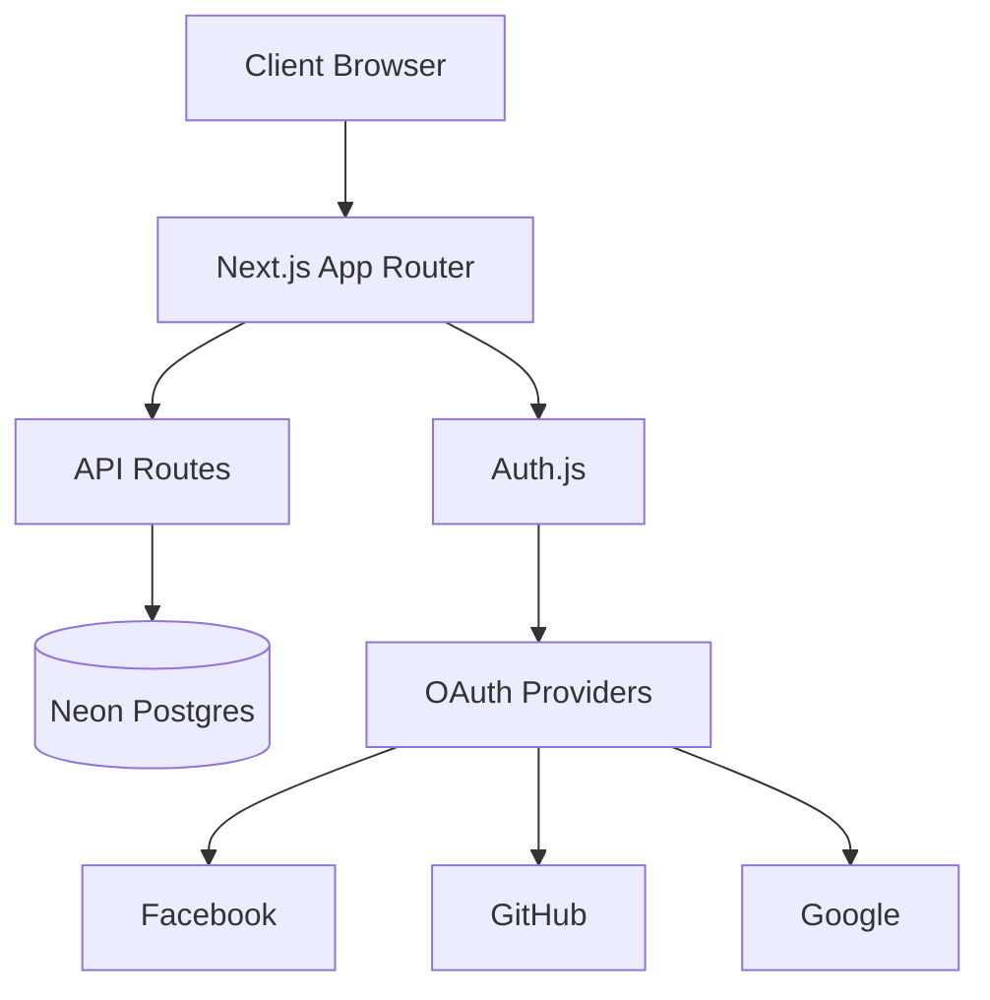
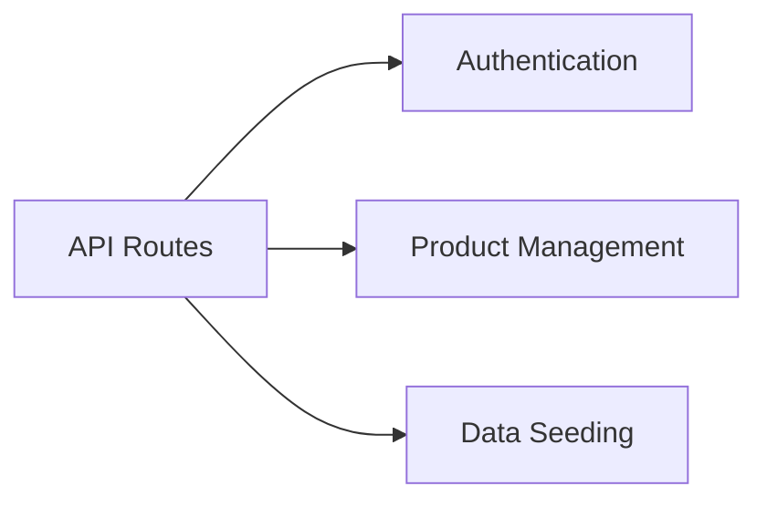

# Architecture Overview

This document provides a detailed overview of the Next.js Admin Dashboard architecture.

## System Architecture



## Core Components

### 1. Frontend Architecture

- **Next.js**: 최신 버전의 Next.js 사용
  * Turbopack 기반 개발 서버 (next dev --turbopack)
  * App Router 기반의 서버 사이드 렌더링
  * Turbopack을 활용한 빠른 개발 환경
  * Server Components 활용
  * TypeScript 기반 개발

- **UI Components**:
  * Radix UI 기반 컴포넌트 (@radix-ui/react-*)
  * Tailwind CSS를 활용한 스타일링
  * 반응형 디자인 구현

- **Analytics**:
  * @vercel/analytics 통합
  * 성능 모니터링 및 사용자 행동 분석

### 2. Authentication System

- **NextAuth**:
  * Google, GitHub, Facebook OAuth 제공자 지원
  * 커스텀 로그인 페이지 (/login)
  * JWT 기반 세션 관리
  * 사용자 정보 자동 동기화
  ```typescript
  callbacks: {
    session: 사용자 세션에 provider 정보 추가
    signIn: 사용자 데이터 자동 생성/업데이트
    jwt: provider 정보를 토큰에 추가
    authorized: 페이지별 인증 권한 검사
  }
  ```

### 3. Database Layer

- **Neon Postgres**: 서버리스 PostgreSQL 데이터베이스
- **Drizzle ORM**: Type-safe 데이터베이스 작업
- **Schema**:
  ```typescript
  // users
  {
    email: text('email').primaryKey(),
    name: text('name').notNull(),
    imageUrl: text('image_url'),
    provider: text('provider').notNull(),
    updatedAt: timestamp('updated_at').defaultNow(),
    createdAt: timestamp('created_at').defaultNow()
  }

  // products
  {
    id: serial('id').primaryKey(),
    userId: text('user_id').references(() => users.email),
    imageUrl: text('image_url'),
    name: text('name').notNull(),
    description: text('description'),
    status: statusEnum('status').notNull(),
    price: numeric('price', { precision: 10, scale: 2 }).notNull(),
    stock: integer('stock').notNull(),
    updatedAt: timestamp('updated_at', { withTimezone: true }).defaultNow(),
    createdAt: timestamp('created_at', { withTimezone: true }).defaultNow()
  }
  ```

### 4. API Architecture



- **Product Management**:
  * 페이지네이션 지원 (3개씩 로딩)
  * 검색 기능 (ilike 패턴 매칭)
  * 상태 필터링 (active, inactive, archived)
  * 사용자별 필터링
  * 최신 업데이트 순 정렬

- **Data Seeding**:
  * 초기 데이터 생성
  * 시퀀스 리셋

## Development Environment

### Package Management
```json
{
  "dependencies": {
    "next": "15.1.3",
    "react": "19.0.0",
    "next-auth": "5.0.0-beta.25",
    "@neondatabase/serverless": "^0.9.5",
    "drizzle-orm": "^0.31.4"
  }
}
```

### Development Tools
- pnpm: 효율적인 패키지 관리
- TypeScript 5.7.2: 타입 안정성
- Prettier: 코드 포맷팅
  ```json
  {
    "arrowParens": "always",
    "singleQuote": true,
    "tabWidth": 2,
    "trailingComma": "none"
  }
  ```

## Security Features

1. **인증 보안**
   - OAuth 2.0 프로토콜
   - JWT 기반 세션
   - 미들웨어 기반 라우트 보호

2. **데이터베이스 보안**
   - Prepared Statements
   - 타입 안전성
   - 참조 무결성

3. **API 보안**
   - 인증 미들웨어
   - 입력 값 검증
   - 에러 처리

## Performance Optimization

1. **서버 사이드 최적화**
   - Server Components
   - Edge Runtime 지원
   - 데이터베이스 쿼리 최적화

2. **클라이언트 사이드 최적화**
   - Code Splitting
   - 이미지 최적화
   - 번들 크기 최적화

## Deployment

- Vercel 플랫폼 활용
- 환경 변수 관리
  ```
  POSTGRES_URL=
  NEXTAUTH_URL=
  NEXTAUTH_SECRET=
  GITHUB_ID=
  GITHUB_SECRET=
  GOOGLE_ID=
  GOOGLE_SECRET=
  ```

## Future Considerations

1. **확장성**
   - 수평적 확장 지원
   - 캐싱 레이어 도입
   - 데이터베이스 최적화

2. **기능 로드맵**
   - 고급 분석 대시보드
   - 추가 OAuth 제공자
   - 알림 시스템 강화

3. **유지보수**
   - 정기적인 의존성 업데이트
   - 보안 패치 관리
   - 성능 모니터링
