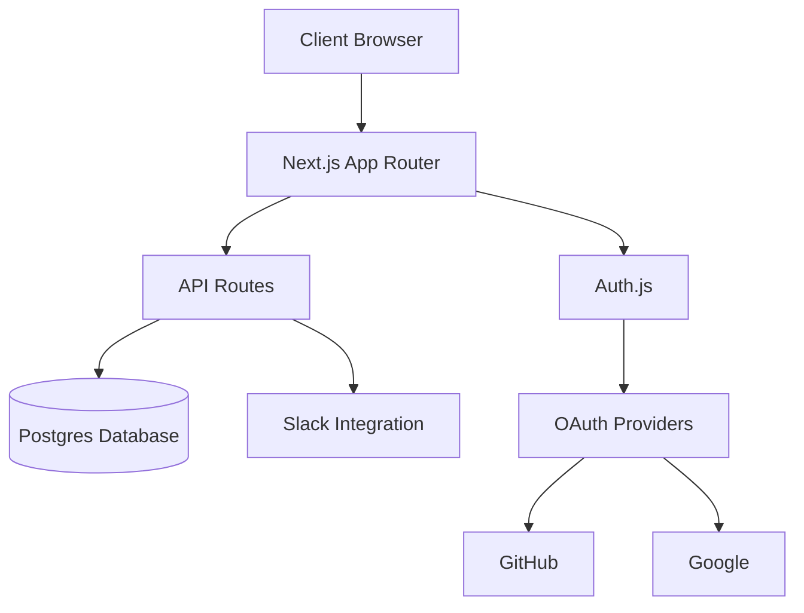
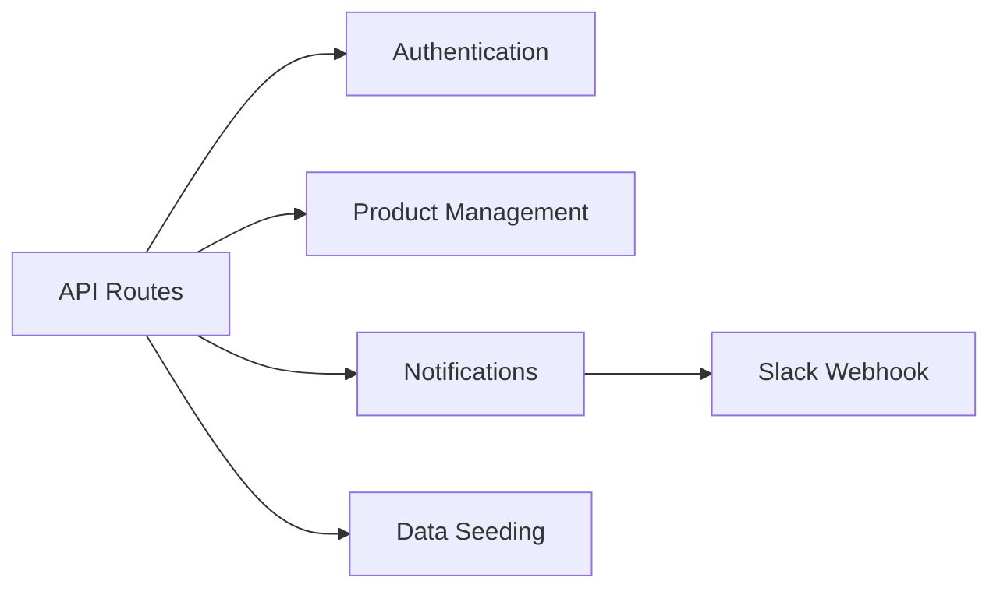

# Architecture Overview

This document provides a detailed overview of the Next.js Admin Dashboard architecture.

## System Architecture



## Core Components

### 1. Frontend Architecture

- **App Router**: Utilizes Next.js 15's App Router for server-side rendering and routing
- **Server Components**: Leverages React Server Components for improved performance
- **Client Components**: Used for interactive UI elements
- **Layout System**: Hierarchical layouts with shared UI elements
- **Streaming**: Implements streaming for improved loading states
- **Route Interception**: Handles modal and overlay views efficiently

### 2. Authentication System

- **Auth.js Integration**: Manages authentication flow
- **Multiple Providers**: Supports GitHub and Google OAuth
- **Session Management**: Server-side session handling
- **Protected Routes**: Middleware-based route protection
- **Role-Based Access**: Authorization checks for different user levels

### 3. Database Layer

- **Schema Design**:
  ```sql
  users
  ├── email (TEXT PRIMARY KEY)
  ├── name (TEXT)
  ├── image (TEXT)
  ├── provider (TEXT)
  └── created_at (TIMESTAMP)

  products
  ├── id (SERIAL PRIMARY KEY)
  ├── image_url (TEXT)
  ├── name (TEXT)
  ├── description (TEXT)
  ├── status (ENUM)
  ├── price (NUMERIC)
  ├── stock (INTEGER)
  └── available_at (TIMESTAMP)

  slack_settings
  ├── id (SERIAL PRIMARY KEY)
  ├── settings (JSONB)
  └── created_at (TIMESTAMP)
  ```
- **ORM**: Drizzle ORM for type-safe database operations
- **Migrations**: Automated schema migrations
- **Connection Pooling**: Efficient database connection management

### 4. API Architecture



- **RESTful Endpoints**: Organized by resource type
- **API Routes**: Serverless functions for backend logic
- **Error Handling**: Standardized error responses
- **Rate Limiting**: Protection against abuse

### 5. Integration Services

#### Slack Integration
- Webhook-based notification system
- Configurable notification settings
- JSON-based settings storage

#### Analytics Integration
- Vercel Analytics for performance monitoring
- User behavior tracking
- Performance metrics collection

## State Management

- Server-side state management using Server Components
- Client-side state handled by React hooks
- Form state managed by controlled components

## Security Measures

1. **Authentication**
   - OAuth 2.0 implementation
   - Secure session management
   - CSRF protection

2. **Data Protection**
   - Input validation
   - SQL injection prevention
   - XSS protection

3. **API Security**
   - Route protection
   - Request validation
   - Rate limiting

## Performance Optimization

1. **Server-Side Rendering**
   - Improved initial page load
   - SEO optimization
   - Reduced client-side JavaScript

2. **Asset Optimization**
   - Image optimization
   - Code splitting
   - Bundle size optimization

3. **Caching Strategy**
   - Static page caching
   - API response caching
   - Database query optimization

## Development Workflow

1. **Local Development**
   ```bash
   pnpm dev        # Start development server
   pnpm build      # Production build
   pnpm start      # Start production server
   ```

2. **Deployment Pipeline**
   - Automatic deployment via Vercel
   - Environment variable management
   - Database migrations

3. **Code Quality**
   - TypeScript for type safety
   - Prettier for code formatting
   - Component-based architecture

## Future Considerations

1. **Scalability**
   - Horizontal scaling capabilities
   - Cache layer implementation
   - Database optimization

2. **Feature Roadmap**
   - Enhanced analytics dashboard
   - Additional OAuth providers
   - Advanced notification system

3. **Maintenance**
   - Regular dependency updates
   - Security patch management
   - Performance monitoring
